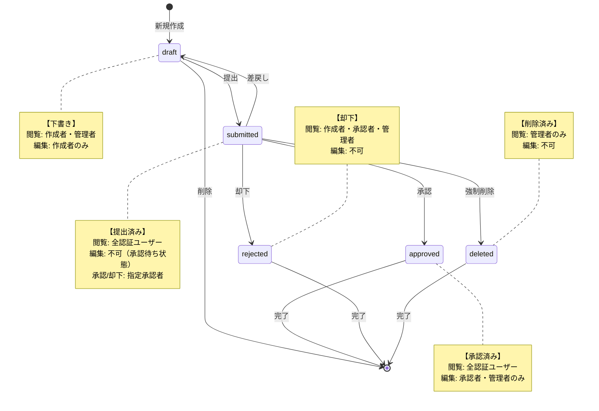

# ナレッジ承認ワークフローシステム - 要件定義書

## プロジェクト概要

### システム目的
ナレッジの修正案を承認するワークフローのためのフロントエンドアプリケーション

### 技術構成
- **フロントエンド**: Next.js 15 (App Router) + TypeScript
- **バックエンド**: FastAPI (既存)
- **認証**: JWT（アクセストークン方式）
- **対象デバイス**: デスクトップのみ（モバイル対応なし）

## MVP版 機能要件

### 画面構成
1. **ログイン認証** - JWT認証
2. **修正案一覧** - 全体の修正案表示
3. **承認済み修正案一覧** - 承認完了した修正案
4. **自分の修正案一覧** - ユーザー個人の提出状況
5. **新規修正案作成** - 修正案作成フォーム
6. **承認待ち** - 承認者向けの承認キュー
7. **修正履歴（記事別）** - 特定記事の提出済み履歴

### ユーザー権限
- **user**: 修正案作成・自分の案件閲覧のみ
- **approver**: user権限 + 承認待ち画面・承認操作
- **admin**: 全機能アクセス

### 状態管理とワークフロー

#### 修正案ステータス
修正案(revisions)は以下のステータスで管理されます：
- **draft**: 下書き
- **submitted**: 提出済み
- **approved**: 承認済み
- **rejected**: 却下
- **deleted**: 削除済み

#### ワークフロー図


#### ステータス別権限とアクション

| ステータス | 閲覧権限 | 編集権限 | 可能なアクション |
|-----------|---------|---------|-----------------|
| **draft** | 作成者・admin | 作成者 | 提出、削除 |
| **submitted** | 全認証ユーザー | なし | 承認、却下、差戻し、強制削除 |
| **approved** | 全認証ユーザー | approver・admin | なし（最終状態） |
| **rejected** | 作成者・approver・admin | なし | なし（最終状態） |
| **deleted** | admin のみ | なし | なし（最終状態） |

## 技術仕様

### 認証方式
- **JWT方式**: アクセストークンにroleを含む
- **権限レベル**: admin > approver > user
- **トークン保存**: localStorage
- **認証ヘッダー**: `Authorization: Bearer <token>`

### フロントエンド技術スタック
```
Next.js 15 (App Router)
├── TypeScript (strict mode)
├── Tailwind CSS v4
├── Zustand/React Context (クライアント状態管理)
├── React Query/SWR (サーバー状態管理)
├── Axios (HTTP client)
├── React Hook Form (フォーム管理)
└── Lucide React (アイコン)
```

### API連携
- **ベースURL**: `/api/v1/`
- **認証エンドポイント**: `/api/v1/auth/login`
- **主要エンドポイント**:
  - `/api/v1/proposals/` - 修正案管理
  - `/api/v1/approvals/` - 承認プロセス
  - `/api/v1/revisions/` - リビジョン管理
  - `/api/v1/articles/` - 記事管理

## デザイン仕様

### デザインテイスト
- **コンセプト**: ビジネス系だがシンプル・モダン
- **ベースカラー**: 青系
- **レイアウト**: サイドバーナビゲーション

### カラーパレット
```css
/* プライマリー（青系） */
--primary-50: #eff6ff
--primary-500: #3b82f6  /* メインブルー */
--primary-600: #2563eb  /* ホバー */
--primary-900: #1e3a8a  /* テキスト */

/* ステータス色 */
--green-500: #10b981   /* approved */
--yellow-500: #f59e0b  /* submitted */
--red-500: #ef4444     /* rejected, deleted */
--gray-400: #9ca3af    /* draft */
--orange-500: #f97316  /* 差戻し等の中間状態 */
```

## プロジェクト構造

```
app/
├── (auth)/
│   └── login/page.tsx
├── (dashboard)/
│   ├── layout.tsx           # 認証レイアウト
│   ├── page.tsx            # ダッシュボード
│   ├── revisions/          # 修正案一覧
│   ├── my-revisions/       # 自分の修正案
│   ├── approved/           # 承認済み一覧
│   ├── pending/            # 承認待ち (approver+)
│   ├── create/             # 新規作成
│   └── articles/[id]/history/ # 記事履歴
├── api/                    # API route handlers
├── components/             # 共通コンポーネント
├── hooks/                  # カスタムhooks
├── lib/                    # ユーティリティ
├── types/                  # TypeScript型定義
└── stores/                 # 状態管理
```

## 実装優先順位

### Phase 1: 基盤構築
1. プロジェクトセットアップ
2. APIクライアント実装
3. 認証機能実装
4. FastAPI接続テスト

### Phase 2: コア機能
1. ログイン画面
2. 修正案一覧画面
3. 新規作成画面
4. 承認待ち画面

### Phase 3: 機能拡張
1. 承認済み一覧
2. 自分の修正案一覧
3. 修正履歴画面
4. UI/UX改善

## 非機能要件

### パフォーマンス
- 初回ロード: 3秒以内
- 画面遷移: 1秒以内
- API応答: 2秒以内

### セキュリティ
- JWT認証必須
- 権限制御の徹底
- XSS対策
- CSRF対策

### 可用性
- ブラウザサポート: Chrome, Firefox, Safari, Edge (最新版)
- 解像度: 1920x1080以上推奨

## 制約事項

- モバイル対応は対象外
- リアルタイム更新は不要
- オフライン機能は不要
- 多言語対応は不要