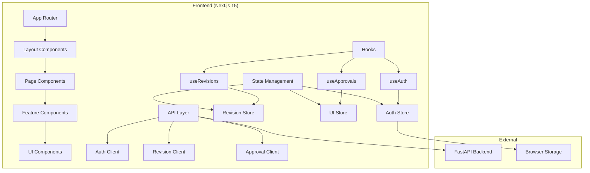
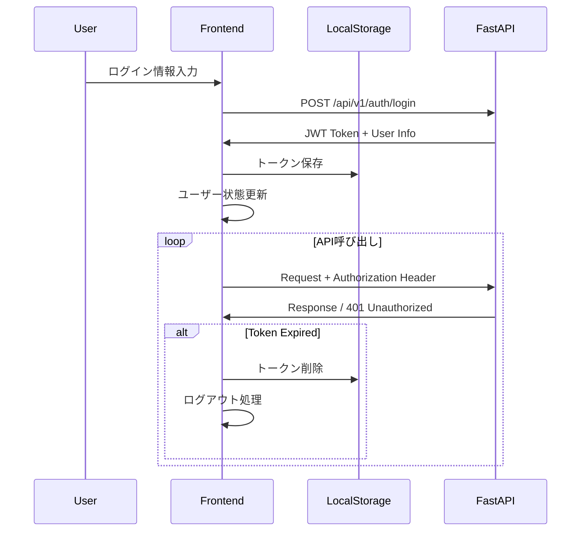

# システム設計書 - ナレッジ承認ワークフローシステム

## 設計概要

要件定義に基づき、Next.js 15を使用したナレッジ承認ワークフローシステムのフロントエンド設計を行います。

### 設計原則
- **コンポーネント駆動開発**: 再利用可能なコンポーネント設計
- **型安全性**: TypeScript strict modeによる堅牢性
- **ユーザビリティ**: 直感的な操作と明確な状態表示
- **パフォーマンス**: 効率的なデータフェッチと状態管理
- **保守性**: 明確な責任分離と拡張可能なアーキテクチャ

---

## フロントエンドアーキテクチャ

### 全体構成


### アーキテクチャレイヤー

#### 1. Presentation Layer (表示層)
- **Page Components**: Next.js App Routerページ
- **Layout Components**: 共通レイアウト構造
- **Feature Components**: 機能特化コンポーネント
- **UI Components**: 再利用可能UI部品

#### 2. Business Logic Layer (ビジネスロジック層)
- **Custom Hooks**: データフェッチとビジネスロジック
- **State Management**: アプリケーション状態管理
- **Service Layer**: API通信とデータ変換

#### 3. Data Access Layer (データアクセス層)
- **API Clients**: RESTful API通信
- **Cache Management**: React Queryによるキャッシュ
- **Local Storage**: 認証トークン管理

---

## コンポーネント設計

### コンポーネント階層
```
app/
├── layout.tsx (Root Layout)
├── page.tsx (Dashboard)
├── (auth)/
│   ├── layout.tsx (Auth Layout)
│   └── login/page.tsx (Login Page)
└── (dashboard)/
    ├── layout.tsx (Dashboard Layout)
    ├── components/
    │   ├── Sidebar.tsx
    │   ├── Header.tsx
    │   └── UserProfile.tsx
    ├── revisions/
    │   ├── page.tsx (Revision List)
    │   ├── components/
    │   │   ├── RevisionTable.tsx
    │   │   ├── RevisionCard.tsx
    │   │   ├── StatusBadge.tsx
    │   │   └── FilterBar.tsx
    │   └── [id]/page.tsx (Revision Detail)
    ├── my-revisions/page.tsx
    ├── approved/page.tsx
    ├── pending/page.tsx
    ├── create/
    │   ├── page.tsx (Create Form)
    │   └── components/
    │       ├── RevisionForm.tsx
    │       ├── ArticleSelector.tsx
    │       └── MarkdownEditor.tsx
    └── articles/[id]/history/page.tsx
```

### 主要コンポーネント仕様

#### 1. Layout Components

##### `DashboardLayout`
```typescript
interface DashboardLayoutProps {
  children: React.ReactNode;
}

// 責任:
// - サイドバーナビゲーション
// - 認証状態チェック
// - ユーザー情報表示
// - 権限による表示制御
```

##### `Sidebar`
```typescript
interface SidebarProps {
  userRole: 'admin' | 'approver' | 'user';
  currentPath: string;
}

// 機能:
// - 権限別ナビゲーション項目表示
// - アクティブ状態管理
// - ユーザー情報表示
// - ログアウト機能
```

#### 2. Feature Components

##### `RevisionTable`
```typescript
interface RevisionTableProps {
  revisions: Revision[];
  userRole: UserRole;
  onStatusChange?: (id: string, status: RevisionStatus) => void;
  onEdit?: (id: string) => void;
  onDelete?: (id: string) => void;
  showActions: boolean;
}

// 機能:
// - 修正案一覧表示
// - ソート・フィルタリング
// - ステータス別表示制御
// - 権限別アクション表示
```

##### `RevisionForm`
```typescript
interface RevisionFormProps {
  initialData?: Partial<Revision>;
  targetArticleId?: string;
  onSubmit: (data: RevisionFormData) => Promise<void>;
  onCancel: () => void;
  mode: 'create' | 'edit';
}

// 機能:
// - React Hook Formによる入力管理
// - バリデーション
// - Markdownエディター統合
// - 記事選択機能
```

##### `ApprovalQueue`
```typescript
interface ApprovalQueueProps {
  revisions: RevisionWithApprovalInfo[];
  onApprove: (id: string, comment?: string) => Promise<void>;
  onReject: (id: string, comment: string) => Promise<void>;
  onReturn: (id: string, comment: string) => Promise<void>;
}

// 機能:
// - 承認待ち一覧表示
// - 優先度ソート
// - 一括操作
// - コメント入力
```

#### 3. UI Components

##### `StatusBadge`
```typescript
interface StatusBadgeProps {
  status: RevisionStatus;
  size?: 'sm' | 'md' | 'lg';
  showText?: boolean;
}

// 機能:
// - ステータス別色分け
// - 一貫したデザイン
// - サイズ調整可能
```

##### `LoadingSpinner`
```typescript
interface LoadingSpinnerProps {
  size?: 'sm' | 'md' | 'lg';
  message?: string;
  fullScreen?: boolean;
}
```

---

## API統合設計

### API Client Architecture
```typescript
// Base API Client
class APIClient {
  private baseURL: string;
  private authToken: string | null;
  
  constructor(baseURL: string) {
    this.baseURL = baseURL;
    this.setupInterceptors();
  }
  
  private setupInterceptors() {
    // Request interceptor: Add auth header
    // Response interceptor: Handle errors, auto-logout
  }
}

// Feature-specific clients
class AuthClient extends APIClient {
  async login(credentials: LoginCredentials): Promise<AuthResponse>
  async logout(): Promise<void>
  async getCurrentUser(): Promise<User>
}

class RevisionClient extends APIClient {
  async getRevisions(params?: RevisionQueryParams): Promise<Revision[]>
  async createRevision(data: RevisionCreateData): Promise<Revision>
  async updateRevision(id: string, data: RevisionUpdateData): Promise<Revision>
  async deleteRevision(id: string): Promise<void>
  async submitRevision(id: string): Promise<Revision>
}

class ApprovalClient extends APIClient {
  async getApprovalQueue(): Promise<ApprovalQueueItem[]>
  async approveRevision(id: string, comment?: string): Promise<void>
  async rejectRevision(id: string, comment: string): Promise<void>
  async returnRevision(id: string, comment: string): Promise<void>
}
```

### React Query Integration
```typescript
// Query Keys
export const queryKeys = {
  revisions: ['revisions'] as const,
  myRevisions: ['revisions', 'my'] as const,
  approvalQueue: ['approvals', 'queue'] as const,
  articles: ['articles'] as const,
  user: ['user'] as const,
} as const;

// Custom Hooks
export function useRevisions(params?: RevisionQueryParams) {
  return useQuery({
    queryKey: [...queryKeys.revisions, params],
    queryFn: () => revisionClient.getRevisions(params),
    staleTime: 5 * 60 * 1000, // 5 minutes
  });
}

export function useCreateRevision() {
  const queryClient = useQueryClient();
  
  return useMutation({
    mutationFn: revisionClient.createRevision,
    onSuccess: () => {
      queryClient.invalidateQueries({ queryKey: queryKeys.revisions });
      queryClient.invalidateQueries({ queryKey: queryKeys.myRevisions });
    },
  });
}
```

---

## 認証・認可設計

### 認証フロー


### 権限制御システム
```typescript
// Permission System
export enum Permission {
  READ_REVISIONS = 'read:revisions',
  WRITE_REVISIONS = 'write:revisions',
  APPROVE_REVISIONS = 'approve:revisions',
  ADMIN_USERS = 'admin:users',
  ADMIN_SYSTEM = 'admin:system',
}

export const rolePermissions: Record<UserRole, Permission[]> = {
  user: [
    Permission.READ_REVISIONS,
    Permission.WRITE_REVISIONS,
  ],
  approver: [
    Permission.READ_REVISIONS,
    Permission.WRITE_REVISIONS,
    Permission.APPROVE_REVISIONS,
  ],
  admin: Object.values(Permission),
};

// Permission Hook
export function usePermissions(user: User | null) {
  const hasPermission = useCallback((permission: Permission) => {
    if (!user) return false;
    return rolePermissions[user.role].includes(permission);
  }, [user]);
  
  const hasAnyPermission = useCallback((permissions: Permission[]) => {
    return permissions.some(hasPermission);
  }, [hasPermission]);
  
  return { hasPermission, hasAnyPermission };
}

// Route Protection
export function withAuth<P extends {}>(
  Component: React.ComponentType<P>,
  requiredPermissions?: Permission[]
) {
  return function AuthenticatedComponent(props: P) {
    const { user } = useAuth();
    const { hasAnyPermission } = usePermissions(user);
    
    if (!user) {
      redirect('/login');
    }
    
    if (requiredPermissions && !hasAnyPermission(requiredPermissions)) {
      return <AccessDenied />;
    }
    
    return <Component {...props} />;
  };
}
```

---

## 状態管理設計

### Zustand Store Architecture
```typescript
// Auth Store
interface AuthState {
  user: User | null;
  token: string | null;
  isAuthenticated: boolean;
  loading: boolean;
}

interface AuthActions {
  login: (credentials: LoginCredentials) => Promise<void>;
  logout: () => void;
  setUser: (user: User) => void;
  setToken: (token: string) => void;
  clearAuth: () => void;
}

export const useAuthStore = create<AuthState & AuthActions>((set, get) => ({
  // State
  user: null,
  token: typeof window !== 'undefined' ? localStorage.getItem('token') : null,
  isAuthenticated: false,
  loading: false,
  
  // Actions
  login: async (credentials) => {
    set({ loading: true });
    try {
      const response = await authClient.login(credentials);
      const { access_token, user } = response;
      
      localStorage.setItem('token', access_token);
      set({ 
        token: access_token,
        user,
        isAuthenticated: true,
        loading: false 
      });
    } catch (error) {
      set({ loading: false });
      throw error;
    }
  },
  
  logout: () => {
    localStorage.removeItem('token');
    set({ 
      user: null, 
      token: null, 
      isAuthenticated: false 
    });
  },
  
  // ... other actions
}));

// UI State Store
interface UIState {
  sidebarOpen: boolean;
  currentView: string;
  loading: Record<string, boolean>;
  errors: Record<string, string>;
}

export const useUIStore = create<UIState & UIActions>(() => ({
  sidebarOpen: true,
  currentView: 'dashboard',
  loading: {},
  errors: {},
  
  setSidebarOpen: (open) => set({ sidebarOpen: open }),
  setCurrentView: (view) => set({ currentView: view }),
  setLoading: (key, loading) => set((state) => ({
    loading: { ...state.loading, [key]: loading }
  })),
  setError: (key, error) => set((state) => ({
    errors: { ...state.errors, [key]: error }
  })),
}));
```

---

## ルーティング設計

### App Router Structure
```typescript
// Route Configuration
export const routes = {
  public: {
    login: '/login',
    register: '/register',
  },
  
  dashboard: {
    home: '/',
    revisions: {
      list: '/revisions',
      detail: '/revisions/[id]',
      create: '/create',
      edit: '/revisions/[id]/edit',
    },
    myRevisions: '/my-revisions',
    approved: '/approved',
    pending: '/pending', // approver+
    articles: {
      history: '/articles/[id]/history',
    },
  },
  
  admin: { // admin only
    users: '/admin/users',
    settings: '/admin/settings',
  },
} as const;

// Route Guards
export const routePermissions: Record<string, Permission[]> = {
  '/pending': [Permission.APPROVE_REVISIONS],
  '/admin/*': [Permission.ADMIN_USERS, Permission.ADMIN_SYSTEM],
};

// Middleware
export function middleware(request: NextRequest) {
  const { pathname } = request.nextUrl;
  const token = request.cookies.get('token')?.value;
  
  // Public routes
  if (pathname.startsWith('/login')) {
    return NextResponse.next();
  }
  
  // Protected routes
  if (!token) {
    return NextResponse.redirect(new URL('/login', request.url));
  }
  
  // Role-based access
  const payload = parseJWT(token);
  const userPermissions = rolePermissions[payload.role];
  
  for (const [route, requiredPerms] of Object.entries(routePermissions)) {
    if (pathname.match(route)) {
      const hasPermission = requiredPerms.some(perm => 
        userPermissions.includes(perm)
      );
      
      if (!hasPermission) {
        return NextResponse.redirect(new URL('/', request.url));
      }
    }
  }
  
  return NextResponse.next();
}
```

### Navigation System
```typescript
// Navigation Configuration
export const navigationItems = [
  {
    key: 'dashboard',
    label: 'ダッシュボード',
    href: '/',
    icon: Home,
    permissions: [],
  },
  {
    key: 'revisions',
    label: '修正案一覧',
    href: '/revisions',
    icon: FileText,
    permissions: [Permission.READ_REVISIONS],
  },
  {
    key: 'my-revisions',
    label: '自分の修正案',
    href: '/my-revisions',
    icon: User,
    permissions: [Permission.READ_REVISIONS],
  },
  {
    key: 'approved',
    label: '承認済み',
    href: '/approved',
    icon: CheckCircle,
    permissions: [Permission.READ_REVISIONS],
  },
  {
    key: 'pending',
    label: '承認待ち',
    href: '/pending',
    icon: Clock,
    permissions: [Permission.APPROVE_REVISIONS],
  },
  {
    key: 'create',
    label: '新規作成',
    href: '/create',
    icon: Plus,
    permissions: [Permission.WRITE_REVISIONS],
  },
] as const;

// Navigation Hook
export function useNavigation() {
  const { user } = useAuth();
  const { hasPermission } = usePermissions(user);
  
  const availableItems = useMemo(() => {
    return navigationItems.filter(item => 
      item.permissions.length === 0 || 
      item.permissions.some(hasPermission)
    );
  }, [hasPermission]);
  
  return { navigationItems: availableItems };
}
```

---

## パフォーマンス設計

### 最適化戦略

#### 1. Code Splitting
```typescript
// Dynamic imports for route components
const PendingPage = dynamic(() => import('./pending/page'), {
  loading: () => <LoadingSkeleton />,
});

const AdminUsersPage = dynamic(() => import('./admin/users/page'), {
  loading: () => <LoadingSkeleton />,
});
```

#### 2. React Query Configuration
```typescript
export const queryClient = new QueryClient({
  defaultOptions: {
    queries: {
      staleTime: 5 * 60 * 1000, // 5 minutes
      cacheTime: 10 * 60 * 1000, // 10 minutes
      retry: 2,
      refetchOnWindowFocus: false,
    },
    mutations: {
      retry: 1,
    },
  },
});
```

#### 3. Bundle Optimization
```typescript
// next.config.ts
const nextConfig: NextConfig = {
  experimental: {
    optimizePackageImports: ['lucide-react', '@radix-ui/*'],
  },
  compiler: {
    removeConsole: process.env.NODE_ENV === 'production',
  },
};
```

---

## セキュリティ設計

### セキュリティ対策

#### 1. XSS Prevention
```typescript
// DOMPurify for content sanitization
import DOMPurify from 'dompurify';

export function sanitizeHTML(content: string): string {
  return DOMPurify.sanitize(content, {
    ALLOWED_TAGS: ['p', 'br', 'strong', 'em', 'ul', 'ol', 'li'],
    ALLOWED_ATTR: [],
  });
}
```

#### 2. Input Validation
```typescript
// Zod schemas for validation
export const revisionSchema = z.object({
  title: z.string().min(1, 'タイトルは必須です').max(200, 'タイトルは200文字以内で入力してください'),
  content: z.string().min(1, '内容は必須です'),
  target_article_id: z.string().uuid('有効な記事IDを指定してください'),
});

export const loginSchema = z.object({
  username: z.string().min(1, 'ユーザー名は必須です'),
  password: z.string().min(1, 'パスワードは必須です'),
});
```

#### 3. CSRF Protection
```typescript
// CSRF token handling
export async function getCSRFToken(): Promise<string> {
  const response = await fetch('/api/csrf-token');
  const { token } = await response.json();
  return token;
}
```

---

## エラーハンドリング設計

### エラー処理戦略
```typescript
// Global error boundary
export class ErrorBoundary extends React.Component<
  { children: React.ReactNode },
  { hasError: boolean; error?: Error }
> {
  constructor(props: { children: React.ReactNode }) {
    super(props);
    this.state = { hasError: false };
  }
  
  static getDerivedStateFromError(error: Error) {
    return { hasError: true, error };
  }
  
  componentDidCatch(error: Error, errorInfo: React.ErrorInfo) {
    console.error('Error caught by boundary:', error, errorInfo);
    // Send error to monitoring service
  }
  
  render() {
    if (this.state.hasError) {
      return <ErrorFallback error={this.state.error} />;
    }
    
    return this.props.children;
  }
}

// API error handling
export class APIError extends Error {
  constructor(
    message: string,
    public status: number,
    public code?: string
  ) {
    super(message);
    this.name = 'APIError';
  }
}

export function handleAPIError(error: unknown): APIError {
  if (error instanceof APIError) {
    return error;
  }
  
  if (axios.isAxiosError(error)) {
    const status = error.response?.status ?? 500;
    const message = error.response?.data?.detail ?? error.message;
    return new APIError(message, status);
  }
  
  return new APIError('予期しないエラーが発生しました', 500);
}
```

---

## テスト設計

### テスト戦略
```typescript
// Component testing with React Testing Library
describe('RevisionTable', () => {
  it('should display revisions correctly', () => {
    const mockRevisions: Revision[] = [
      {
        revision_id: '1',
        title: 'テスト修正案',
        status: 'submitted',
        proposer_id: 'user1',
        target_article_id: 'article1',
        created_at: '2024-01-01',
        updated_at: '2024-01-01',
      },
    ];
    
    render(<RevisionTable revisions={mockRevisions} userRole="user" showActions={false} />);
    
    expect(screen.getByText('テスト修正案')).toBeInTheDocument();
    expect(screen.getByText('提出済み')).toBeInTheDocument();
  });
});

// API testing with MSW
const handlers = [
  rest.get('/api/v1/revisions', (req, res, ctx) => {
    return res(ctx.json([
      {
        revision_id: '1',
        title: 'テスト修正案',
        status: 'submitted',
      },
    ]));
  }),
];

const server = setupServer(...handlers);
```

---

## 実装フェーズ

### Phase 1: 基盤構築
1. **プロジェクトセットアップ**
   - Next.js 15プロジェクト初期化
   - 必要な依存関係のインストール
   - TypeScript/ESLint設定

2. **基盤コンポーネント作成**
   - Layout components
   - UI components
   - Error boundary

3. **認証システム実装**
   - API client設定
   - 認証store実装
   - ログイン画面作成

### Phase 2: コア機能実装
1. **修正案管理機能**
   - 修正案一覧画面
   - 新規作成画面
   - 詳細・編集画面

2. **承認機能**
   - 承認待ちキュー
   - 承認アクション
   - コメント機能

### Phase 3: 機能拡張・最適化
1. **追加機能**
   - 自分の修正案一覧
   - 承認済み一覧
   - 記事履歴

2. **UI/UX改善**
   - レスポンシブ対応
   - アニメーション
   - アクセシビリティ改善

---

## まとめ

この設計書では、要件定義に基づいたナレッジ承認ワークフローシステムの包括的なフロントエンド設計を提示しました。

### 主要な特徴
- **モジュラー設計**: 再利用可能なコンポーネントと明確な責任分離
- **型安全性**: TypeScriptによる堅牢な開発体験
- **パフォーマンス**: React Queryとcode splittingによる最適化
- **セキュリティ**: 包括的な認証・認可と入力検証
- **保守性**: 明確なアーキテクチャと一貫したパターン

この設計に基づいて実装を進めることで、スケーラブルで保守性の高いアプリケーションを構築できます。