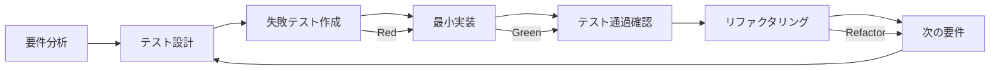

# TDD実装計画書 - ナレッジ承認ワークフローシステム

## TDD実装戦略

既存の実装計画をテスト駆動開発（TDD）アプローチに変更し、**Red-Green-Refactor**サイクルに基づいた開発を行います。

### TDD原則
- **Red**: 失敗するテストを先に書く
- **Green**: テストをパスさせる最小限のコードを書く  
- **Refactor**: コードを改善・最適化する
- **Test First**: 実装前に必ずテストを作成
- **Small Steps**: 小さなサイクルで確実に進歩

### TDD実装フロー


---

## テスト環境セットアップ

### テストツールスタック
```bash
# テスト関連依存関係
npm install -D jest jest-environment-jsdom
npm install -D @testing-library/react @testing-library/jest-dom @testing-library/user-event
npm install -D msw
npm install -D @types/jest
npm install -D cypress @cypress/react

# テストユーティリティ
npm install -D faker
npm install -D jest-axe  # アクセシビリティテスト
```

### テスト設定ファイル

#### Jest設定
```typescript
// jest.config.js
const nextJest = require('next/jest')

const createJestConfig = nextJest({
  dir: './',
})

const customJestConfig = {
  setupFilesAfterEnv: ['<rootDir>/tests/setup.ts'],
  testEnvironment: 'jest-environment-jsdom',
  testMatch: [
    '<rootDir>/**/__tests__/**/*.test.{js,jsx,ts,tsx}',
    '<rootDir>/tests/**/*.test.{js,jsx,ts,tsx}'
  ],
  moduleNameMapping: {
    '^@/(.*)$': '<rootDir>/$1',
  },
  collectCoverageFrom: [
    'app/**/*.{js,jsx,ts,tsx}',
    '!app/**/*.d.ts',
    '!app/**/layout.tsx',
  ],
  coverageThreshold: {
    global: {
      branches: 80,
      functions: 80,
      lines: 80,
      statements: 80,
    },
  },
}

module.exports = createJestConfig(customJestConfig)
```

#### テストセットアップ
```typescript
// tests/setup.ts
import '@testing-library/jest-dom'
import { server } from './mocks/server'
import 'jest-axe/extend-expect'

// MSW setup
beforeAll(() => server.listen())
afterEach(() => server.resetHandlers())
afterAll(() => server.close())

// Mock localStorage
const mockLocalStorage = {
  getItem: jest.fn(),
  setItem: jest.fn(),
  removeItem: jest.fn(),
  clear: jest.fn(),
}
Object.defineProperty(window, 'localStorage', {
  value: mockLocalStorage,
})

// Mock next/navigation
jest.mock('next/navigation', () => ({
  useRouter: () => ({
    push: jest.fn(),
    back: jest.fn(),
    forward: jest.fn(),
    refresh: jest.fn(),
  }),
  useSearchParams: () => ({
    get: jest.fn(),
  }),
  usePathname: () => '/',
}))
```

### テストユーティリティ

#### Test Factories
```typescript
// tests/factories/userFactory.ts
import { faker } from '@faker-js/faker'
import { User } from '@/types/auth'

export function createMockUser(overrides?: Partial<User>): User {
  return {
    user_id: faker.string.uuid(),
    username: faker.internet.userName(),
    email: faker.internet.email(),
    role: 'user',
    is_active: true,
    ...overrides,
  }
}

// tests/factories/revisionFactory.ts
export function createMockRevision(overrides?: Partial<Revision>): Revision {
  return {
    revision_id: faker.string.uuid(),
    title: faker.lorem.sentence(),
    content: faker.lorem.paragraphs(3),
    status: 'draft',
    proposer_id: faker.string.uuid(),
    target_article_id: faker.string.uuid(),
    created_at: faker.date.past().toISOString(),
    updated_at: faker.date.recent().toISOString(),
    ...overrides,
  }
}
```

#### Testing Utilities
```typescript
// tests/utils/renderWithProviders.tsx
import { render } from '@testing-library/react'
import { QueryClient, QueryClientProvider } from '@tanstack/react-query'
import { ReactNode } from 'react'

export function renderWithProviders(ui: ReactNode) {
  const queryClient = new QueryClient({
    defaultOptions: {
      queries: { retry: false },
      mutations: { retry: false },
    },
  })

  return render(
    <QueryClientProvider client={queryClient}>
      {ui}
    </QueryClientProvider>
  )
}

// tests/utils/mockStore.ts
export function createMockAuthStore(initialState?: Partial<AuthState>) {
  return {
    user: null,
    token: null,
    isAuthenticated: false,
    loading: false,
    login: jest.fn(),
    logout: jest.fn(),
    ...initialState,
  }
}
```

#### MSW設定
```typescript
// tests/mocks/handlers.ts
import { rest } from 'msw'
import { createMockUser, createMockRevision } from '../factories'

export const handlers = [
  // Auth endpoints
  rest.post('/api/v1/auth/login/json', (req, res, ctx) => {
    return res(
      ctx.json({
        access_token: 'mock-token',
        token_type: 'bearer',
        user: createMockUser({ role: 'admin' }),
      })
    )
  }),

  // Revision endpoints
  rest.get('/api/v1/revisions/', (req, res, ctx) => {
    return res(
      ctx.json([
        createMockRevision({ status: 'submitted' }),
        createMockRevision({ status: 'approved' }),
      ])
    )
  }),

  rest.post('/api/v1/revisions/', (req, res, ctx) => {
    return res(ctx.json(createMockRevision()))
  }),
]

// tests/mocks/server.ts
import { setupServer } from 'msw/node'
import { handlers } from './handlers'

export const server = setupServer(...handlers)
```

---

## Phase 1: TDD基盤構築（Day 1-5）

### Day 1: テスト環境とUIコンポーネントTDD

#### 🔴 **TDD 1.1: Button コンポーネント** (2時間)

##### Step 1: Red - 失敗するテストを作成
```typescript
// tests/components/ui/Button.test.tsx
import { render, screen } from '@testing-library/react'
import userEvent from '@testing-library/user-event'
import { Button } from '@/components/ui/Button'

describe('Button', () => {
  it('renders with children text', () => {
    render(<Button>Click me</Button>)
    expect(screen.getByRole('button', { name: 'Click me' })).toBeInTheDocument()
  })

  it('applies correct variant classes', () => {
    render(<Button variant="primary">Primary</Button>)
    const button = screen.getByRole('button')
    expect(button).toHaveClass('bg-primary-600')
  })

  it('handles click events', async () => {
    const handleClick = jest.fn()
    render(<Button onClick={handleClick}>Click me</Button>)
    
    await userEvent.click(screen.getByRole('button'))
    expect(handleClick).toHaveBeenCalledTimes(1)
  })

  it('shows loading state correctly', () => {
    render(<Button loading>Loading</Button>)
    expect(screen.getByRole('button')).toBeDisabled()
    expect(screen.getByTestId('loading-spinner')).toBeInTheDocument()
  })

  it('is accessible with keyboard navigation', async () => {
    render(<Button>Accessible Button</Button>)
    const button = screen.getByRole('button')
    
    button.focus()
    expect(button).toHaveFocus()
    
    await userEvent.keyboard('{Enter}')
    // Test keyboard interaction
  })
})
```

##### Step 2: Green - テストをパスさせる最小実装
```typescript
// app/components/ui/Button.tsx
import { ButtonHTMLAttributes, ReactNode } from 'react'
import { cn } from '@/lib/utils'

interface ButtonProps extends ButtonHTMLAttributes<HTMLButtonElement> {
  children: ReactNode
  variant?: 'primary' | 'secondary' | 'outline' | 'ghost'
  size?: 'sm' | 'md' | 'lg'
  loading?: boolean
}

export function Button({
  children,
  variant = 'primary',
  size = 'md',
  loading = false,
  className,
  disabled,
  ...props
}: ButtonProps) {
  const baseClasses = 'inline-flex items-center justify-center rounded-md font-medium transition-colors focus:outline-none focus:ring-2 focus:ring-offset-2 disabled:opacity-50 disabled:pointer-events-none'
  
  const variantClasses = {
    primary: 'bg-primary-600 text-white hover:bg-primary-700 focus:ring-primary-500',
    secondary: 'bg-gray-200 text-gray-900 hover:bg-gray-300 focus:ring-gray-500',
    outline: 'border border-gray-300 bg-white text-gray-700 hover:bg-gray-50 focus:ring-gray-500',
    ghost: 'text-gray-700 hover:bg-gray-100 focus:ring-gray-500',
  }
  
  const sizeClasses = {
    sm: 'h-8 px-3 text-xs',
    md: 'h-10 px-4 text-sm',
    lg: 'h-12 px-6 text-base',
  }

  return (
    <button
      className={cn(
        baseClasses,
        variantClasses[variant],
        sizeClasses[size],
        className
      )}
      disabled={disabled || loading}
      {...props}
    >
      {loading && (
        <div
          data-testid="loading-spinner"
          className="mr-2 h-4 w-4 animate-spin rounded-full border-b-2 border-current"
        />
      )}
      {children}
    </button>
  )
}
```

##### Step 3: Refactor - コード改善
- Tailwind classes optimization
- Type safety improvements
- Performance considerations

#### 🔴 **TDD 1.2: Input コンポーネント** (2時間)

##### Step 1: Red - テスト作成
```typescript
// tests/components/ui/Input.test.tsx
describe('Input', () => {
  it('renders with label', () => {
    render(<Input label="Email" />)
    expect(screen.getByLabelText('Email')).toBeInTheDocument()
  })

  it('shows error state correctly', () => {
    render(<Input label="Email" error="Invalid email" />)
    expect(screen.getByRole('textbox')).toHaveClass('border-red-500')
    expect(screen.getByText('Invalid email')).toBeInTheDocument()
  })

  it('handles controlled input correctly', async () => {
    const handleChange = jest.fn()
    render(<Input value="test" onChange={handleChange} />)
    
    const input = screen.getByRole('textbox')
    await userEvent.type(input, 'ing')
    expect(handleChange).toHaveBeenCalled()
  })

  it('is accessible with proper ARIA attributes', () => {
    render(<Input label="Email" error="Invalid email" required />)
    const input = screen.getByRole('textbox')
    
    expect(input).toHaveAttribute('aria-invalid', 'true')
    expect(input).toHaveAttribute('aria-required', 'true')
    expect(input).toHaveAttribute('aria-describedby')
  })
})
```

##### Step 2: Green - 実装
```typescript
// app/components/ui/Input.tsx
interface InputProps extends InputHTMLAttributes<HTMLInputElement> {
  label?: string
  error?: string
  helperText?: string
}

export function Input({
  label,
  error,
  helperText,
  id,
  className,
  ...props
}: InputProps) {
  const inputId = id || `input-${Math.random().toString(36).substr(2, 9)}`
  const errorId = error ? `${inputId}-error` : undefined
  const helperId = helperText ? `${inputId}-helper` : undefined

  return (
    <div className="w-full">
      {label && (
        <label htmlFor={inputId} className="block text-sm font-medium text-gray-700 mb-1">
          {label}
          {props.required && <span className="text-red-500 ml-1">*</span>}
        </label>
      )}
      
      <input
        id={inputId}
        className={cn(
          'block w-full rounded-md border px-3 py-2 text-sm focus:outline-none focus:ring-2 focus:ring-offset-2',
          error 
            ? 'border-red-500 focus:border-red-500 focus:ring-red-500' 
            : 'border-gray-300 focus:border-primary-500 focus:ring-primary-500',
          className
        )}
        aria-invalid={error ? 'true' : 'false'}
        aria-describedby={cn(errorId, helperId)}
        {...props}
      />
      
      {error && (
        <p id={errorId} className="mt-1 text-xs text-red-600" role="alert">
          {error}
        </p>
      )}
      
      {helperText && !error && (
        <p id={helperId} className="mt-1 text-xs text-gray-500">
          {helperText}
        </p>
      )}
    </div>
  )
}
```

### Day 2: 認証システムTDD

#### 🔴 **TDD 2.1: 認証ストア** (4時間)

##### Step 1: Red - 認証ストアテスト
```typescript
// tests/stores/authStore.test.ts
import { renderHook, act } from '@testing-library/react'
import { useAuthStore } from '@/stores/authStore'
import { createMockUser } from '../factories/userFactory'

describe('AuthStore', () => {
  beforeEach(() => {
    // Reset store state
    useAuthStore.getState().clearAuth()
    localStorage.clear()
  })

  it('initializes with empty state', () => {
    const { result } = renderHook(() => useAuthStore())
    
    expect(result.current.user).toBeNull()
    expect(result.current.token).toBeNull()
    expect(result.current.isAuthenticated).toBe(false)
    expect(result.current.loading).toBe(false)
  })

  it('handles successful login', async () => {
    const { result } = renderHook(() => useAuthStore())
    const mockUser = createMockUser()
    const mockToken = 'mock-jwt-token'

    await act(async () => {
      await result.current.login({
        username: 'testuser',
        password: 'password',
      })
    })

    expect(result.current.user).toEqual(mockUser)
    expect(result.current.token).toBe(mockToken)
    expect(result.current.isAuthenticated).toBe(true)
    expect(localStorage.setItem).toHaveBeenCalledWith('token', mockToken)
  })

  it('handles login failure', async () => {
    const { result } = renderHook(() => useAuthStore())
    
    // Mock failed login
    server.use(
      rest.post('/api/v1/auth/login/json', (req, res, ctx) => {
        return res(ctx.status(401), ctx.json({ detail: 'Invalid credentials' }))
      })
    )

    await act(async () => {
      try {
        await result.current.login({
          username: 'wrong',
          password: 'wrong',
        })
      } catch (error) {
        // Expected error
      }
    })

    expect(result.current.user).toBeNull()
    expect(result.current.isAuthenticated).toBe(false)
    expect(result.current.loading).toBe(false)
  })

  it('handles logout correctly', () => {
    const { result } = renderHook(() => useAuthStore())
    
    // Set initial authenticated state
    act(() => {
      result.current.setAuth('token', createMockUser())
    })

    act(() => {
      result.current.logout()
    })

    expect(result.current.user).toBeNull()
    expect(result.current.token).toBeNull()
    expect(result.current.isAuthenticated).toBe(false)
    expect(localStorage.removeItem).toHaveBeenCalledWith('token')
  })

  it('restores auth state from localStorage on initialization', () => {
    const mockToken = 'stored-token'
    localStorage.getItem.mockReturnValue(mockToken)
    
    const { result } = renderHook(() => useAuthStore())
    
    expect(result.current.token).toBe(mockToken)
  })
})
```

##### Step 2: Green - 認証ストア実装
```typescript
// app/stores/authStore.ts
import { create } from 'zustand'
import { User } from '@/types/auth'
import { authClient } from '@/lib/api/auth'

interface AuthState {
  user: User | null
  token: string | null
  isAuthenticated: boolean
  loading: boolean
}

interface AuthActions {
  login: (credentials: LoginCredentials) => Promise<void>
  logout: () => void
  setAuth: (token: string, user: User) => void
  clearAuth: () => void
}

export const useAuthStore = create<AuthState & AuthActions>((set, get) => ({
  user: null,
  token: typeof window !== 'undefined' ? localStorage.getItem('token') : null,
  isAuthenticated: false,
  loading: false,

  login: async (credentials) => {
    set({ loading: true })
    try {
      const response = await authClient.login(credentials)
      const { access_token, user } = response
      
      localStorage.setItem('token', access_token)
      set({
        token: access_token,
        user,
        isAuthenticated: true,
        loading: false,
      })
    } catch (error) {
      set({ loading: false })
      throw error
    }
  },

  logout: () => {
    localStorage.removeItem('token')
    set({
      user: null,
      token: null,
      isAuthenticated: false,
    })
  },

  setAuth: (token, user) => {
    localStorage.setItem('token', token)
    set({
      token,
      user,
      isAuthenticated: true,
    })
  },

  clearAuth: () => {
    localStorage.removeItem('token')
    set({
      user: null,
      token: null,
      isAuthenticated: false,
      loading: false,
    })
  },
}))
```

#### 🔴 **TDD 2.2: ログイン画面** (4時間)

##### Step 1: Red - ログインフォームテスト
```typescript
// tests/components/auth/LoginForm.test.tsx
import { render, screen, waitFor } from '@testing-library/react'
import userEvent from '@testing-library/user-event'
import { LoginForm } from '@/components/auth/LoginForm'
import { renderWithProviders } from '../../utils/renderWithProviders'

describe('LoginForm', () => {
  it('renders login form correctly', () => {
    renderWithProviders(<LoginForm />)
    
    expect(screen.getByLabelText(/ユーザー名/i)).toBeInTheDocument()
    expect(screen.getByLabelText(/パスワード/i)).toBeInTheDocument()
    expect(screen.getByRole('button', { name: /ログイン/i })).toBeInTheDocument()
  })

  it('shows validation errors for empty fields', async () => {
    const user = userEvent.setup()
    renderWithProviders(<LoginForm />)
    
    const submitButton = screen.getByRole('button', { name: /ログイン/i })
    await user.click(submitButton)

    await waitFor(() => {
      expect(screen.getByText(/ユーザー名は必須です/i)).toBeInTheDocument()
      expect(screen.getByText(/パスワードは必須です/i)).toBeInTheDocument()
    })
  })

  it('submits form with valid data', async () => {
    const user = userEvent.setup()
    renderWithProviders(<LoginForm />)
    
    await user.type(screen.getByLabelText(/ユーザー名/i), 'testuser')
    await user.type(screen.getByLabelText(/パスワード/i), 'password123')
    await user.click(screen.getByRole('button', { name: /ログイン/i }))

    await waitFor(() => {
      // Check if login was successful (redirect or state change)
      expect(window.location.pathname).toBe('/')
    })
  })

  it('shows error message for invalid credentials', async () => {
    const user = userEvent.setup()
    
    // Mock failed login response
    server.use(
      rest.post('/api/v1/auth/login/json', (req, res, ctx) => {
        return res(
          ctx.status(401),
          ctx.json({ detail: 'ユーザー名またはパスワードが間違っています' })
        )
      })
    )
    
    renderWithProviders(<LoginForm />)
    
    await user.type(screen.getByLabelText(/ユーザー名/i), 'wronguser')
    await user.type(screen.getByLabelText(/パスワード/i), 'wrongpass')
    await user.click(screen.getByRole('button', { name: /ログイン/i }))

    await waitFor(() => {
      expect(screen.getByText(/ユーザー名またはパスワードが間違っています/i)).toBeInTheDocument()
    })
  })

  it('shows loading state during submission', async () => {
    const user = userEvent.setup()
    renderWithProviders(<LoginForm />)
    
    await user.type(screen.getByLabelText(/ユーザー名/i), 'testuser')
    await user.type(screen.getByLabelText(/パスワード/i), 'password123')
    
    const submitButton = screen.getByRole('button', { name: /ログイン/i })
    await user.click(submitButton)

    expect(screen.getByTestId('loading-spinner')).toBeInTheDocument()
    expect(submitButton).toBeDisabled()
  })

  it('is accessible with proper ARIA attributes', () => {
    renderWithProviders(<LoginForm />)
    
    const form = screen.getByRole('form')
    expect(form).toHaveAttribute('aria-label', 'ログインフォーム')
    
    const usernameInput = screen.getByLabelText(/ユーザー名/i)
    expect(usernameInput).toHaveAttribute('aria-required', 'true')
    
    const passwordInput = screen.getByLabelText(/パスワード/i)
    expect(passwordInput).toHaveAttribute('aria-required', 'true')
  })
})
```

##### Step 2: Green - ログインフォーム実装
```typescript
// app/components/auth/LoginForm.tsx
'use client'

import { useForm } from 'react-hook-form'
import { zodResolver } from '@hookform/resolvers/zod'
import { z } from 'zod'
import { useRouter } from 'next/navigation'
import { Button } from '@/components/ui/Button'
import { Input } from '@/components/ui/Input'
import { useAuthStore } from '@/stores/authStore'
import { useState } from 'react'

const loginSchema = z.object({
  username: z.string().min(1, 'ユーザー名は必須です'),
  password: z.string().min(1, 'パスワードは必須です'),
})

type LoginFormData = z.infer<typeof loginSchema>

export function LoginForm() {
  const router = useRouter()
  const login = useAuthStore((state) => state.login)
  const loading = useAuthStore((state) => state.loading)
  const [error, setError] = useState<string>('')

  const {
    register,
    handleSubmit,
    formState: { errors },
  } = useForm<LoginFormData>({
    resolver: zodResolver(loginSchema),
  })

  const onSubmit = async (data: LoginFormData) => {
    try {
      setError('')
      await login(data)
      router.push('/')
    } catch (err: any) {
      setError(err.response?.data?.detail || 'ログインに失敗しました')
    }
  }

  return (
    <form
      onSubmit={handleSubmit(onSubmit)}
      className="space-y-6"
      aria-label="ログインフォーム"
      role="form"
    >
      <div>
        <Input
          label="ユーザー名"
          type="text"
          autoComplete="username"
          required
          error={errors.username?.message}
          {...register('username')}
        />
      </div>

      <div>
        <Input
          label="パスワード"
          type="password"
          autoComplete="current-password"
          required
          error={errors.password?.message}
          {...register('password')}
        />
      </div>

      {error && (
        <div className="text-sm text-red-600" role="alert">
          {error}
        </div>
      )}

      <Button
        type="submit"
        variant="primary"
        className="w-full"
        loading={loading}
        disabled={loading}
      >
        ログイン
      </Button>
    </form>
  )
}
```

### Day 3-5: APIクライアントとルート保護のTDD

同様のRed-Green-Refactorサイクルで以下を実装：

- **APIクライアント**: リクエスト/レスポンス、エラーハンドリング
- **React Query統合**: キャッシュ戦略、無効化
- **ルート保護**: ミドルウェア、権限チェック
- **ダッシュボード**: レイアウト、ナビゲーション

---

## Phase 2: TDDコア機能実装（Day 6-12）

### Day 6-7: 修正案管理TDD

#### 🔴 **TDD 2.1: RevisionTable コンポーネント**

##### Step 1: Red - テスト作成
```typescript
// tests/components/features/RevisionTable.test.tsx
describe('RevisionTable', () => {
  it('displays revision data correctly', () => {
    const mockRevisions = [
      createMockRevision({ title: 'テスト修正案1', status: 'submitted' }),
      createMockRevision({ title: 'テスト修正案2', status: 'approved' }),
    ]
    
    render(<RevisionTable revisions={mockRevisions} userRole="admin" showActions />)
    
    expect(screen.getByText('テスト修正案1')).toBeInTheDocument()
    expect(screen.getByText('テスト修正案2')).toBeInTheDocument()
    expect(screen.getByText('提出済み')).toBeInTheDocument()
    expect(screen.getByText('承認済み')).toBeInTheDocument()
  })

  it('shows appropriate actions based on user role', () => {
    const mockRevisions = [createMockRevision({ status: 'draft' })]
    
    const { rerender } = render(
      <RevisionTable revisions={mockRevisions} userRole="user" showActions />
    )
    
    expect(screen.getByRole('button', { name: /編集/i })).toBeInTheDocument()
    expect(screen.queryByRole('button', { name: /削除/i })).toBeInTheDocument()
    
    rerender(<RevisionTable revisions={mockRevisions} userRole="approver" showActions />)
    
    expect(screen.getByRole('button', { name: /承認/i })).toBeInTheDocument()
  })

  it('handles sorting correctly', async () => {
    const user = userEvent.setup()
    const mockRevisions = [
      createMockRevision({ title: 'B修正案', created_at: '2024-01-01' }),
      createMockRevision({ title: 'A修正案', created_at: '2024-01-02' }),
    ]
    
    render(<RevisionTable revisions={mockRevisions} userRole="user" showActions={false} />)
    
    // Click on title column to sort
    await user.click(screen.getByRole('button', { name: /タイトル/i }))
    
    const rows = screen.getAllByRole('row')
    expect(rows[1]).toHaveTextContent('A修正案')
    expect(rows[2]).toHaveTextContent('B修正案')
  })

  it('calls onEdit when edit button is clicked', async () => {
    const user = userEvent.setup()
    const mockOnEdit = jest.fn()
    const mockRevisions = [createMockRevision({ revision_id: 'test-id' })]
    
    render(
      <RevisionTable
        revisions={mockRevisions}
        userRole="user"
        onEdit={mockOnEdit}
        showActions
      />
    )
    
    await user.click(screen.getByRole('button', { name: /編集/i }))
    expect(mockOnEdit).toHaveBeenCalledWith('test-id')
  })

  it('is accessible with proper ARIA attributes', () => {
    const mockRevisions = [createMockRevision()]
    
    render(<RevisionTable revisions={mockRevisions} userRole="user" showActions={false} />)
    
    const table = screen.getByRole('table')
    expect(table).toHaveAttribute('aria-label', '修正案一覧')
    
    const headers = screen.getAllByRole('columnheader')
    headers.forEach(header => {
      expect(header).toHaveAttribute('scope', 'col')
    })
  })
})
```

### Day 8-9: 新規作成・編集TDD

#### 🔴 **TDD 2.2: RevisionForm コンポーネント**

同様のTDDアプローチで実装：
- フォームバリデーション
- 自動保存機能
- Markdownエディター統合

### Day 10-12: 承認機能TDD

#### 🔴 **TDD 2.3: ApprovalQueue コンポーネント**

承認キュー機能のTDD実装：
- 承認アクション
- 一括操作
- コメント機能

---

## Phase 3: TDD機能拡張・最適化（Day 13-18）

### Day 13-15: 追加機能TDD

同様のRed-Green-Refactorサイクルで：
- 承認済み一覧
- 記事履歴表示
- 検索・フィルタリング

### Day 16-18: 品質向上・最適化TDD

- パフォーマンステスト
- アクセシビリティテスト
- E2Eテスト拡充

---

## TDD成功指標

### コードカバレッジ目標
- **単体テスト**: 90%以上
- **統合テスト**: 80%以上
- **E2Eテスト**: 主要フロー100%

### 品質指標
- **TypeScriptエラー**: 0件
- **ESLintエラー**: 0件
- **テスト実行時間**: 30秒以内
- **アクセシビリティスコア**: 95%以上

### TDDサイクル遵守
- [ ] 実装前に必ずテスト作成
- [ ] Red-Green-Refactorサイクル遵守
- [ ] 小さなサイクルでの開発
- [ ] リファクタリング段階での品質向上

## TDD実装チェックリスト

### Phase 1: 基盤TDD
- [ ] テスト環境セットアップ完了
- [ ] 基本UIコンポーネントTDD実装
- [ ] 認証システムTDD実装
- [ ] APIクライアントTDD実装
- [ ] 全テストパス（90%+カバレッジ）

### Phase 2: コア機能TDD
- [ ] 修正案管理TDD実装
- [ ] 承認機能TDD実装
- [ ] フォーム機能TDD実装
- [ ] 統合テストパス
- [ ] パフォーマンステスト基準達成

### Phase 3: 拡張機能TDD
- [ ] 追加機能TDD実装
- [ ] E2Eテスト完成
- [ ] アクセシビリティテストパス
- [ ] 品質目標達成

TDD原則に従った実装により、高品質で保守性の高いコードベースを構築し、バグの少ない安定したシステムを実現します。